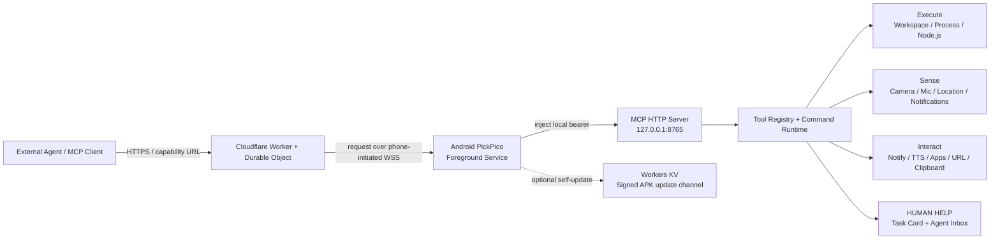

# PickPico

PickPico turns an Android phone into a **Mobile Agent Node**: a persistent MCP execution node that
lets an external Agent use Android as a place to execute work, sense the physical world, and interact
with the person carrying the device.

> Renamed from **MCPocket** to **PickPico** on 2026-09-03 because of a project-name collision. Legacy
> Android package/storage identifiers and the current demo relay hostname intentionally retain
> `mcpocket` for upgrade compatibility.

> FUTUREMODE × SITCON Hackathon 2026 · AI Agents & Automation · pre-hackathon baseline

## 100–200 字作品摘要

AI Agent 很會在雲端工作，卻很難跨進真實世界：它看不到現場，也常在需要人類協助時反覆失敗。PickPico 把 Android 手機變成標準 MCP Mobile Agent Node，讓 Agent 可遠端執行程式、使用相機、麥克風、通知、語音與位置，並透過 HUMAN HELP 向身邊的人請求文字、選項或照片；Cloudflare Relay 讓手機跨網路仍能持續連線。

## 問題與解法

今天的 Agent 很擅長操作 API、瀏覽器與雲端工具，但一離開電腦就會撞上一道「物理世界牆」：

- 它無法直接看到使用者眼前的東西，也無法聽取現場聲音。
- 它需要人類完成一個幾秒鐘的小動作時，往往只能放棄或在工具裡繞圈。
- 手機雖然有相機、麥克風、GPS、通知、喇叭與 App，卻通常不是 Agent runtime 的一部分。
- Agent 與手機不在同一個 LAN 時，NAT、行動網路與防火牆又會把連線切開。

PickPico 的做法不是再做一個「手機遙控器」，而是把 Android 變成 Agent 可以直接使用的標準 MCP 節點，分成三類能力：

1. **Execute**：workspace、shell process、background session、embedded Node.js。
2. **Sense**：camera、microphone、location、Android notification state。
3. **Interact**：notification、TTS、App / URL、clipboard，以及 HUMAN HELP。

其中 **HUMAN HELP** 是刻意保留給 Agent 的「人類出口」。當 AI 判斷某件事交給附近的人做只要幾秒、自己卻可能耗費大量時間或根本做不到時，它可以直接提出清楚的操作請求，等待人類回傳文字、選項或照片後繼續原任務。

## 核心 Demo

最短的展示路徑只需要一支 Android 手機與一個 MCP client：

1. Agent 透過 Cloudflare Relay 連上不同網路上的 PickPico。
2. Agent 呼叫 `location.get`、`camera.capture` 或 `notification.list` 取得真實世界資訊。
3. Agent 可用 `phone.notify`、`phone.speak`、`app.launch` 或 `url.open` 對手機產生動作。
4. 碰到「AI 繼續做很笨，人類做一下很快」的步驟時，呼叫 `human.help`。
5. 手機跳出 HUMAN HELP 任務卡；使用者可回覆文字、按選項、選照片或直接拍照。
6. 人類回覆後，原本等待中的 Agent tool call 收到結果並接著完成工作。

例如 HUMAN HELP 可以透過穩定的 `command_run` 入口呼叫：

```json
{
  "commandId": "human.help",
  "arguments": {
    "title": "幫我看一下這個實體裝置",
    "instruction": "請確認面板上的綠燈是否亮著；如果看不清楚，可以直接拍一張照片。",
    "actions": ["綠燈有亮", "沒有亮", "看不確定"],
    "allowTextReply": true,
    "allowImages": true,
    "maxImages": 3,
    "idleTimeoutSeconds": 180
  }
}
```

HUMAN HELP 的 timeout 是「人類閒置時間」而不是死板的總時限。打字、開啟請求、選圖或拍照都會續租等待時間；目前每次可選 120 / 180 / 360 秒，Relay 另外保留較長的 transport safety timeout，避免人在操作時 HTTP request 被提前切掉。

### Optional Sponsor Bounty：PickPico Financial Agent

> **有多餘時間才做。不得為了 Sponsor Bounty 犧牲 PickPico 主 Demo 的穩定度。**

若核心作品、影片與現場備援都已穩定，可額外把既有 PickPico 能力組成金融 Agent workflow，作為企業命題延伸，而不是修改 PickPico 核心定位：

```text
支付需求
  ↓
Agent 查詢鏈上價格 / balance / fee
  ↓
準備 stablecoin transaction（不持有私鑰、不自行簽署）
  ↓
human.help 顯示金額、收款人、chain、fee，要求本人確認
  ↓
url.open / app.launch 開啟既有 Wallet
  ↓
使用者在 Wallet 內親自簽署
  ↓
Agent 監看 transaction status / Android notification
  ↓
繼續 invoice、付款確認或後續企業 workflow
```

實作原則：優先使用 **testnet 或 mock stablecoin**；PickPico 不實作 wallet custody、不保存私鑰、不代替使用者簽章。這個情境要展示的是「Agent 可以代理流程，但高風險授權仍能乾淨地 hand off 給人類」。

**提醒：只有在主 Demo、README、2 分鐘影片、真機備援都完成後，才開始這顆 Sponsor DLC。**

## 系統架構



同一支手機也保留 LAN 直連模式：

```text
MCP Client --HTTP + Bearer--> http://<phone-ip>:8765/mcp
```

遠端模式則由手機主動建立 outbound WSS，因此不需要 public IP、port forwarding 或 VPN：

```text
Agent --HTTPS--> PickPico Relay --WSS--> Android PickPico --HTTP loopback--> :8765/mcp
```

## 目前功能狀態

| 類別 | 已完成 |
| --- | --- |
| MCP / Runtime | Streamable HTTP、legacy + MCP `2026-07-28` discovery、tool registry、schema-stable `command_run` |
| Execute | private workspace、UTF-8 file read/write/list、sandbox shell、background process、output/kill、embedded Node.js |
| Sense | camera capture、microphone WAV、location、active notification list/get、Hyper Accessibility UI tree inspection |
| Interact | Android notification、TTS、ring、wake、App list/launch、URL/deep-link open、clipboard、Hyper UI action/type/scroll、notification action/reply |
| Human-in-the-loop | HUMAN HELP + Approval 共用 request card/notification、text/actions、gallery/camera attachments、renewable idle timeout、Agent Inbox |
| Agent policy | capability list/status、Core/Hyper availability、Ask Me / Auto-approve / YOLO approval policy |
| Remote | phone-initiated WSS relay、Cloudflare Worker + Durable Object、stable capability URL、Wi-Fi/5G handoff reconnect |
| Update | manifest check、signed APK verification、PackageInstaller、Cloudflare Workers KV release channel |
| Safety boundaries | Android runtime permissions、Device Admin opt-in for lock、app sandbox for shell、separate relay secret/local bearer |

目前 Android source 版本：**0.15.3** (`versionCode 36`)。`0.14.0` (`versionCode 31`) 已驗證實機可從舊品牌版本 `0.13.6` (`versionCode 30`) 經 SHA-256、package identity、signing certificate 與 Android 安裝確認原地升級為 PickPico；0.14.1 追加 Hyper Mode 的 Restricted settings / Accessibility 人工授權導引，0.15.0 加入 user-authorized MediaProjection `screen.capture`，0.15.1 再把它暴露成 direct MCP media tool，0.15.2 讓 schema-stable `command_run` 也能原生回傳 image/audio content，0.15.3 追加 package-replaced Node/Relay continuity：若更新前 Node 正在運行，更新後會自動恢復 base runtime，PickPico UI 再回前景時補回完整 media foreground types。

## Current implementation snapshot

- Treat MCPocket as a Mobile Agent Node rather than only a bag of phone-specific MCP tools.
- Organize the node around three jobs: **Execute**, **Sense**, and **Interact**.
- Let Agents capture Android camera frames through `camera_capture` / `camera.capture`; images are stored under the private workspace and returned as native MCP image content.
- Let Agents post Android notifications through `phone_notify` / `phone.notify`.
- Let Agents speak through Android TextToSpeech with `phone_speak` / `phone.speak`.
- Let Agents record mono 16 kHz WAV audio through `microphone_record` / `microphone.record`; audio is stored under the private workspace and returned as native MCP audio content.
- Track long-lived Agent work through `task_runtime_info`, `task_create`, `task_update`, and `task_status`.
- Model task states explicitly: `created`, `running`, `blocked`, `waiting_human`, `completed`,
  `failed`, and `cancelled`.
- Start and stop a foreground MCP node from the app.
- Serve Streamable HTTP on `http://<phone-ip>:8765/mcp`.
- Reach the same MCP node across unrelated networks through an outbound reverse relay connection;
  the current reference backend is a Cloudflare Worker + Durable Object deployment.
- Authenticate every MCP POST with a per-start bearer token.
- Keep compatibility tools including `server_info`, `phone_status`, `phone_ring`, restricted `phone_exec`, and `phone_echo`.
- Expose a capability-oriented command runtime through `command_list`, `command_run`, and `command_status`.
- Keep a persistent private workspace under the MCPocket app data directory.
- Read, write, and recursively list workspace files without shell-escaping file contents.
- Resolve relative `exec_command.cwd` values below the workspace root.
- Keep long-running commands alive as managed background sessions with `read_output` and `kill_session`.
- Run workspace JavaScript through an APK-embedded Node.js runtime in an isolated `:node` Android process.
- Download and verify self-update APKs, then expose a foreground **Update MCPocket** button so Android's required install confirmation is user-initiated instead of relying on background popups.
- Support the legacy initialize flow and the MCP `2026-07-28` stateless discovery flow.
- Keep MCP protocol/transport separate from Android tool implementations through a tool registry.

Current command IDs:

- `node.info`
- `phone.status`
- `capability.list`
- `capability.status`
- `policy.status`
- `phone.ring`
- `phone.lock` (requires one-time Device Admin opt-in)
- `phone.wake`
- `phone.echo`
- `camera.capture`
- `phone.notify`
- `phone.speak`
- `microphone.record`
- `human.help`
- `human.help.status`
- `notification.list`
- `notification.get`
- `notification.dismiss`
- `notification.actions`
- `notification.invoke_action`
- `notification.reply`
- `ui.inspect` (Hyper Mode + Accessibility Service)
- `ui.action` (Hyper Mode + Accessibility Service)
- `ui.type` (Hyper Mode + Accessibility Service)
- `ui.scroll` (Hyper Mode + Accessibility Service)
- `app.list`
- `app.launch`
- `url.open`
- `location.get`
- `clipboard.get`
- `clipboard.set`
- `workspace.info`
- `workspace.list`
- `workspace.read`
- `workspace.write`
- `node.start`
- `node.status`
- `node.stop`
- `app.update`
- `app.update_check`
- `app.update_latest`
- `app.update_status`
- `process.run` (predefined diagnostics only)
- `process.exec` (general Linux shell execution inside the MCPocket app sandbox)
- `process.output`
- `process.stop`

MCP also exposes `exec_command` as a direct convenience tool for `process.exec`. It executes through
`/system/bin/sh -c` and supports optional `cwd`, `env`, `stdin`, `timeoutMs`, `maxOutputBytes`, and
`background`. The default working directory is MCPocket's private workspace root. Relative `cwd`
values resolve below that root; absolute paths remain available for advanced sandbox-visible paths.
Synchronous results keep `stdout` and `stderr` separate and report exit code, timeout, duration, and
output truncation.

With `background=true`, `exec_command` returns immediately with a `sessionId` and leaves the process
running. Use `read_output` to inspect its captured output/status and `kill_session` to stop it. This is
the foundation for dev servers and other long-lived project processes.

Workspace-native MCP tools are available as `workspace_info`, `workspace_list`,
`workspace_read_file`, and `workspace_write_file`. Workspace file paths are always relative and are
canonicalized so `..` traversal cannot escape the workspace root.

`process.exec` is intentionally powerful but it does not escape Android's app sandbox. Commands run
as the MCPocket app UID, not as ADB shell, root, or the Android system user.

Node.js is exposed separately from `exec_command`. Android does not treat MCPocket's writable
workspace as a place for executable binaries, so MCPocket packages `libnode.so` with the APK and
starts workspace JavaScript through JNI in an isolated `:node` service process. MCP tools
`node_start`, `node_status`, and `node_stop` manage that runtime without stopping the MCP server.

The current Node runtime is a bootstrap POC based on nodejs-mobile 18.20.4 for `arm64-v8a`. It has
been smoke-tested on a Samsung S23 by writing `server.js` through the MCP workspace API, starting it
with `node_start`, reaching its HTTP server over Wi-Fi, and then stopping the runtime process. It is
not yet the intended long-term Node distribution/version strategy.

Self-update candidates are downloaded into MCPocket private storage and are accepted only when the
SHA-256 matches, the package name is MCPocket, the signing certificate matches the installed app,
and the candidate version is newer. Once staged, the app UI shows the candidate version and enables
an update button. Android still owns the final install confirmation; MCPocket does not bypass it.

MCPocket can also update itself without ADB through `app_update`. The updater downloads an HTTP(S)
APK in the background, requires the exact SHA-256 up front, checks that the package name and signing
certificate match the installed MCPocket, rejects downgrades, and streams the verified APK into
Android's `PackageInstaller`. Android may require a one-time "Install unknown apps" grant for
MCPocket and then shows the system install/update confirmation UI. Progress and installer state are
available through `app_update_status`.

The older phone-specific MCP tools remain available for compatibility, but they execute through the
same command runtime. New capabilities should be added as commands rather than wiring new behavior
directly into the HTTP/MCP transport layer.

## Mobile capabilities

MCPocket's phone-specific value is not shell execution by itself. The Android device is an Agent
node with physical-world capabilities:

- **Execute**: workspace files, sandboxed shell processes, background sessions, and embedded Node.js.
- **Sense**: camera and microphone today; location and other sensors can be added behind the same
  capability-oriented command runtime.
- **Interact**: Android notifications, TextToSpeech, vibration/ringing, and later structured human
  input/approval flows.

`camera_capture` defaults to the back camera, limits the requested JPEG stream to roughly 1280 px,
persists the image below `media/camera/`, and returns an MCP `image` content item so a vision-capable
Agent can consume the frame directly. Set `returnContent=false` when only workspace persistence is
needed.

`microphone_record` defaults to three seconds of mono 16 kHz / 16-bit PCM wrapped as WAV, persists
the recording below `media/microphone/`, and returns an MCP `audio` content item. Recording duration
is limited to 0.5-10 seconds per call so one request cannot occupy a server worker indefinitely.

Camera and microphone are Android while-in-use permissions. When **Start node** is pressed,
MCPocket asks for any missing Camera/Microphone grants and starts its foreground service with the
corresponding media service types. If a permission is denied, the node still starts, but that
capability reports `requiresSetup=true`; grant the permission and restart the node from the app.

`phone_exec` remains the legacy restricted diagnostic tool. New general Linux command execution should
use `exec_command` or `command_run` with `process.exec`.

`phone.lock` never attempts to elevate itself. Until the user explicitly enables MCPocket's
force-lock Device Admin policy in the Android system UI, the command returns `requiresSetup=true`.

Git and Python toolchains are not bundled yet. `workspace_info` reports which executables are
actually visible to MCPocket's Android app sandbox; the embedded Node runtime is managed through the
dedicated Node commands instead of appearing as a shell executable. ADB-style device control, FYT,
SSH, automatic discovery, and UI polish are not implemented yet.

## Remote connectivity

MCPocket does not require the Agent and phone to share a LAN. The Android node can keep its local
Streamable HTTP endpoint while also opening an outbound WebSocket connection to an MCPocket relay:

```text
Agent --HTTPS--> MCPocket Relay --WSS--> MCPocket --HTTP loopback--> 127.0.0.1:8765/mcp
```

The phone initiates the relay connection, so Android does not need an inbound public IP, port
forwarding, or a VPN. The remote endpoint is an unguessable capability URL based on a persistent
128-bit random node ID. Remote clients do not need to send the phone's bearer token. MCPocket
injects that token only on the private loopback hop, where the existing MCP server still validates
it. This also makes the remote endpoint compatible with MCP clients such as ChatGPT that support
OAuth or no authentication but do not expose arbitrary static request headers in their setup UI.

For the current hackathon/demo build, the project-operated relay is:

```text
https://relay.mcpocket.workers.dev
```

This endpoint is demo infrastructure, not a promise of a free public relay service for arbitrary
third-party installations. Before a general open-source release, users should be able to provide
their own relay URL or deploy the reference relay themselves. The reference Cloudflare deployment
lives under `relay/` and can also be deployed temporarily for evaluation without depending on the
project-operated endpoint.

When a relay is configured and **RELAY STATUS** becomes `CONNECTED`, **COPY CONNECTION JSON** uses
the remote HTTPS endpoint. If no relay is configured, MCPocket continues to work over its local LAN
endpoint.

Provider-specific private transports such as OpenAI Secure MCP Tunnel are a possible future adapter,
not a requirement for MCPocket remote access. The default remote design remains client-neutral so a
non-OpenAI MCP client can use the same node.

## Workspace POC flow

Once the node is running, an MCP client can create and run a project entirely inside the phone:

1. Call `workspace_info` to discover the workspace root and available executables.
2. Call `workspace_write_file` with `path: "hello/run.sh"` and the project contents.
3. Call `exec_command` with `cwd: "hello"` and `command: "sh run.sh"`.
4. For a long-running process, add `background: true`, then poll `read_output` with the returned
   `sessionId` and stop it with `kill_session` when finished.

The workspace survives node restarts and normal app updates because it lives in MCPocket's app data.
It is removed if the app is uninstalled.

## Node workspace POC flow

1. Write a JavaScript entry point, for example `hello-node/server.js`, with `workspace_write_file`.
2. Call `node_start` with `{ "entry": "hello-node/server.js" }`.
3. Call `node_status` to verify the isolated `:node` process is running.
4. If the script opens a LAN server, connect directly to the phone IP and the script's port.
5. Call `node_stop` to terminate only the Node runtime while leaving the MCP node running.

The first build downloads the nodejs-mobile Android runtime archive and installs the configured NDK
and CMake versions through the Android Gradle toolchain when they are not already present.

## Build / 執行方式

建置環境：

- Java 17
- Gradle 8.7
- Android SDK 35
- Android NDK `27.3.13750724`
- CMake `3.22.1`
- Android 8.0+ (`minSdk 26`), current APK target is `arm64-v8a`

第一次 build 會下載 nodejs-mobile 18.20.4 Android runtime；Gradle task 會先驗證固定的
SHA-256，再解開並放進 APK，不直接信任未驗證的下載內容。

```powershell
cd MCPocket
gradle :app:testDebugUnitTest :app:assembleDebug
```

Debug APK:

`app\build\outputs\apk\debug\app-debug.apk`

For local debug smoke tests, an ADB shell can ask the protected debug bridge to start the real MCP
node without touching the phone UI:

```powershell
pwsh scripts/dev-node-start.ps1
```

The debug bridge can then exercise the real authenticated loopback MCP transport without exposing
the bearer token to the host command line:

```powershell
pwsh scripts/dev-command.ps1 -CommandId phone.status
pwsh scripts/dev-command.ps1 -CommandId phone.ring -ArgumentsJson '{"durationSeconds":10}'
```

## Connect

### Local LAN

1. Put the phone and MCP client on the same trusted LAN.
2. Open MCPocket and press **Start node**.
3. Copy the displayed connection JSON into an MCP client that supports custom HTTP headers.
4. List tools, call `server_info`, then call `phone_echo` with `{ "text": "hello phone" }`.

### Remote relay

1. Open MCPocket and enter a relay base URL under **REMOTE RELAY**.
2. Press **Start node** (or restart the node after changing the relay URL).
3. Wait for **RELAY STATUS** to become `CONNECTED`.
4. Use **COPY CONNECTION JSON**. MCPocket now returns an HTTPS remote endpoint with
   `"authentication": "none"` instead of the LAN endpoint and bearer header.
5. The phone can move to cellular data or another Wi-Fi network without changing the Agent-side MCP
   URL, as long as its outbound Internet connection remains available.

See `docs/remote-transport.md` for protocol, security, deployment, and open-source release notes.

The **local LAN MCP endpoint** rejects requests without its bearer token and rejects non-loopback
browser origins. The remote endpoint intentionally uses a high-entropy capability URL instead of a
custom HTTP authorization header; treat the full remote URL as a credential and do not publish it.

## Self-update channel

MCPocket now has two update paths:

- `app_update(url, sha256)` is the low-level path for a specific APK.
- `app_update_check()` and `app_update_latest()` use a stable update manifest, so the Agent no longer
  has to discover an APK URL and checksum before every update.

By default, the manifest is resolved from the configured relay at `/v1/update/latest`. If no relay
is configured, the project demo relay is used. A self-hosted installation can override
`manifestUrl` on either tool.

The manifest contains `versionName`, `versionCode`, `apkUrl`, `sha256`, and `publishedAt`. MCPocket
still verifies the downloaded APK's SHA-256, package name, signing certificate, and version before
handing it to Android's package installer. The update channel removes deployment plumbing without
removing the existing APK verification boundary.

The reference relay stores release APKs in a dedicated Workers KV namespace. APKs are split into
20 MiB chunks so they stay below KV's single-value size limit, then streamed back to Android as one
normal APK response. `latest.json` is written last, so clients never see a half-published release.
Publishing a new build is one command:

```powershell
pwsh scripts/publish-update.ps1
```

The script builds the APK, reads its version from `app/build.gradle`, calculates SHA-256, deploys
the relay, uploads immutable versioned chunks plus metadata, and replaces `latest.json` last.

## ADB development bridge

Debug builds expose a tiny smoke-test bridge protected by Android's `DUMP` permission. Ordinary
third-party apps cannot invoke it, release builds ignore it, and the MCP HTTP authentication path
is unchanged. It exists so local development tools can trigger observable actions without copying
the node credential through terminal arguments.

```powershell
pwsh scripts/phone-find.ps1
pwsh scripts/phone-find.ps1 -DurationSeconds 30
pwsh scripts/phone-find.ps1 -Stop
```

## Android 權限與安全邊界

PickPico 不會為了 Demo 偷繞過 Android 的權限模型：

| 能力 | Android / PickPico 邊界 |
| --- | --- |
| Camera | 使用者授權 `CAMERA`，node 由使用者啟動後才可使用 |
| Microphone | 使用者授權 `RECORD_AUDIO`，錄音限制 0.5–10 秒/次 |
| Location | 使用者授權 coarse/fine location；未授權時回傳 setup guidance |
| Notification read/dismiss | 使用者必須在系統設定手動開啟 Notification Listener access |
| Hyper UI / Accessibility | 必須由手機持有人在 Android 系統 UI 親自授權。側載 APK 可能先要求到 App info 的 `⋮ → Allow restricted settings`，再到 Accessibility 開啟 **PickPico Hyper UI Control**。PickPico 可以開啟正確設定頁並引導流程，但不能替自己核准這些安全門 |
| Phone lock | 使用者必須一次性啟用 Device Admin；沒有權限就拒絕 |
| Phone wake | 只點亮螢幕，不解鎖裝置 |
| `process.exec` | 只以 PickPico app UID 在 Android app sandbox 執行，不是 root / ADB shell |
| HUMAN HELP | 人類回覆與圖片保存在 app private storage；附件空間有 100 MiB 上限與清理機制 |
| Remote relay | relay secret、remote capability URL、local bearer 是三個不同安全邊界 |
| Self-update | SHA-256、package name、signing certificate、version 全部驗證後才交給 Android installer |

目前 Cloudflare Relay 是黑客松/展示用 reference deployment，不主張它已經是可公開給任意第三方使用的 production multi-tenant service。正式公開營運前仍需補 rate limiting、abuse control、配額與更完整的營運監控。

## Cloudflare Relay

reference implementation 位於 `relay/`：

```text
relay/
├─ src/index.js       # Worker + Durable Object + update routes
├─ wrangler.jsonc     # bindings / migration
├─ package.json
└─ README.md
```

自架：

```bash
cd relay
npm install
npx wrangler login
npx wrangler deploy
```

`wrangler.jsonc` 內的 `UPDATE_KV` namespace ID 屬於目前專案的 Cloudflare account resource identifier，
不是 API secret；自行部署者應建立自己的 Workers KV namespace 並替換該 ID。Wrangler 登入憑證、
`.dev.vars`、`.env*`、`node_modules/` 與 local build artifacts 不進 Git。

目前專案展示 relay：

```text
https://relay.mcpocket.workers.dev
```

主要路由：

```text
GET  /health
GET  /v1/nodes/<node-id>/status
GET  /v1/nodes/<node-id>/connect       # phone WSS upgrade
POST /v2/nodes/<node-id>/mcp           # current remote MCP endpoint
GET  /v1/update/latest
GET  /v1/update/files/releases/<apk>
```

## Repository layout

```text
MCPocket/
├─ app/                         # Android Mobile Agent Node
│  └─ src/main/java/com/mcpocket/poc/
│     ├─ McpHttpServer.java     # local Streamable HTTP
│     ├─ McpProtocol.java       # MCP protocol handling
│     ├─ McpToolRegistry.java   # stable MCP-facing tool registry
│     ├─ CommandRuntime.java    # capability command catalog / validation
│     ├─ McpNodeService.java    # Android foreground node service
│     ├─ RelayClient.java       # outbound WSS reverse relay client
│     ├─ AndroidDeviceCapabilities.java
│     ├─ AndroidAgentActions.java
│     ├─ HumanHelpStore.java / HumanHelpActivity.java
│     ├─ AgentInboxStore.java / AgentInboxActivity.java
│     └─ McpNotificationListenerService.java
├─ relay/                       # Cloudflare Worker + Durable Object + KV update channel
├─ docs/remote-transport.md     # remote transport/security design
├─ docs/demo-runbook.md         # hackathon primary demo / fallback / readiness checklist
├─ docs/product-spec-v0.1.md    # Core/Hyper capabilities, approval policy and platform roadmap
├─ scripts/                     # build, debug and update publishing helpers
└─ README.md
```

## Product spec / 開發規格

目前 Core Mode、⚡ Hyper Mode、Android 權限能力、Approval Policy、HUMAN HELP 共用 UI、Android-first / iOS Companion 策略與後續開發順序，統一整理在：

- [`docs/product-spec-v0.1.md`](docs/product-spec-v0.1.md)

這份文件是目前黑客松開發的產品規格基準；實作狀態會明確區分「已完成」與「規劃中」，避免把 roadmap 當成現成功能。

## Hackathon readiness infrastructure

這一節只描述目前已建立的展示與驗證基礎設施，**不代表產品整體完成度**。目前產品仍在功能收斂、Hyper Mode、Approval Policy 與 UI/UX 開發階段。

- [x] Android Mobile Agent Node 核心能力
- [x] HUMAN HELP 人機 handoff
- [x] Cloudflare 跨網路 relay
- [x] build + unit tests
- [x] README / 架構 / 來源揭露 / LICENSE
- [x] 主 Demo 與 fallback runbook
- [x] 一鍵 readiness script
- [ ] 現場連續跑至少 3 次完整主 Demo
- [ ] 錄製 2 分鐘評選影片
- [ ] 最後公開 repo / 權限檢查
- [ ] Optional：Financial Agent Sponsor Bounty

開發或上場前可先跑：

```powershell
pwsh scripts/hackathon-readiness.ps1
```

有 Android debug 裝置接著時，可進一步驗真機：

```powershell
pwsh scripts/hackathon-readiness.ps1 -Device
pwsh scripts/hackathon-readiness.ps1 -Device -HumanHelp
```

完整展示順序與失敗切換方式見 `docs/demo-runbook.md`。

## 黑客松既有開發 / 來源揭露

本專案**不是在比賽開場後才從空 repo 起手**。FUTUREMODE × SITCON 2026 一般賽道允許提前準備與開發，因此我們刻意保留一個清楚的 pre-hackathon 基線，讓評審可從 Git history 分辨「賽前已有」與「活動期間新增」。

### Pre-hackathon baseline

- 專案最早 Git history：2026-08-16。
- 本 README 所描述、且包含在 tag **`pre-hackathon-2026-09-03`** 的內容，皆視為活動前既有開發。
- 2026-09-04 活動開始後的新增與修改會留在此 tag 之後的 commits，不改寫這個基線。
- 這個基線包含：Android MCP server、command runtime、workspace/process runtime、embedded Node.js、self-update、相機/麥克風/通知/TTS、task runtime、Android Agent actions、HUMAN HELP、Agent Inbox，以及 Cloudflare remote relay / update channel。

### 第三方程式、服務與素材

| 項目 | 用途 | 說明 |
| --- | --- | --- |
| Model Context Protocol (MCP) | Agent/tool interoperability | 依公開 protocol 實作；本專案未使用 Java MCP SDK |
| Android SDK / platform APIs | App、permissions、camera/mic/location、PackageInstaller 等 | Android 平台能力 |
| AndroidX Core 1.13.1 | `FileProvider` 等 AndroidX utilities | 第三方 OSS dependency |
| OkHttp 4.12.0 | Android HTTP / WebSocket relay client | 第三方 OSS dependency |
| nodejs-mobile 18.20.4 | APK 內嵌 Node.js runtime | build 時下載並驗證固定 SHA-256 |
| Cloudflare Workers | public HTTPS relay edge | remote transport reference backend |
| Cloudflare Durable Objects | 每個 node 的 WebSocket/session state | reference backend |
| Cloudflare Workers KV | APK update manifest/chunks | self-update distribution |
| Wrangler 4.x | Relay deploy / KV publishing | `relay/package.json` dev dependency |
| JUnit 4.13.2 | JVM unit tests | test-only dependency |
| `org.json` 20250517 | JVM JSON behavior in tests | test-only dependency |

第三方元件各自依其原始授權條款使用；本 repository 不重新授權第三方套件本身。

### AI-assisted development disclosure

開發過程使用 ChatGPT / OpenAI coding agents 協助程式設計、除錯、測試與文件整理。最終程式碼、架構選擇與裝置測試由團隊負責。本 repository 不包含第三方模型權重、訓練資料集或必須綁定單一模型供應商才能運作的 runtime；任何支援 MCP 的 client 都可以作為 Agent 端。

## 黑客松提交規範對照

| 官方要求 | 本 repository 對應 |
| --- | --- |
| 100–200 字問題與解法摘要 | README 開頭「100–200 字作品摘要」 |
| 公開 GitHub / GitLab repository | 提交前將本 repo 公開；目前 pre-hackathon snapshot 先保留為 private/local baseline |
| 授權文件 | `LICENSE` (MIT) |
| README | 本文件 |
| 系統架構 | 「系統架構」Mermaid + transport diagrams |
| 執行方式 | 「Build / 執行方式」與「Connect」 |
| 來源說明 | 「黑客松既有開發 / 來源揭露」 |
| Demo URL | 選填；`relay.mcpocket.workers.dev` 是 transport infrastructure，不冒充作品展示頁 |
| 2 分鐘內評審影片 | 活動提交時另附 YouTube 連結 |

## License

MCPocket original source code is released under the [MIT License](LICENSE). Third-party dependencies
and services remain subject to their own licenses and terms.
