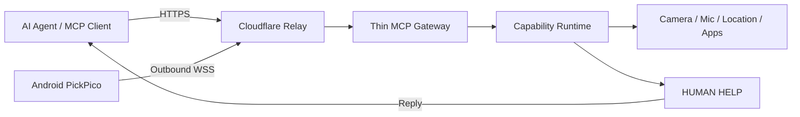

# PickPico
> Ｇive your AI Agent's eyes, hands, and human connection.
PickPico 把手機變成可被 AI Agent 使用的 **Mobile Agent Node**。Agent 不只能呼叫雲端 API，還能透過手機看見現場、理解螢幕、操作 App、發出通知；
遇到必須由人判斷或動手處理的事情，則透過 HUMAN HELP 工具把任務交給手機旁的人，取得回覆後繼續工作。
FUTUREMODE × SITCON Hackathon 2026 · AI Agents & Automation
## 作品摘要
把 Android 手機變成 AI Agent 可以透過 MCP 使用的「Agent hardware platform」：
camera + mic + GPS + screen + speaker + vibration + cellular + battery + apps + humanAgent 能讀取手機與現場資訊、操作 App；遇到 AI 無法自行完成的實體任務時，再透過 HUMAN HELP 請附近的人協助。
## 為什麼是 PickPico
PickPico
Most Agent tools extend what an AI can call. PickPico extends where an AI can exist.
## 核心架構
  AI Agent
     ↓ HTTPS / MCP
  Cloudflare Relay
     ↓ WebSocket
  Android PickPico
     ↓
  相機、麥克風、GPS、螢幕、App、通知、Shell
     ↓
  必要時 HUMAN HELP → 真人回答／拍照／按實體按鈕


## 系統架構



手機主動建立對外連線，因此不需要 public IP、port forwarding 或 VPN；在可信任的相同區域網路中，也可以直接連線：

```text
Remote: Agent ─HTTPS→ Cloudflare Relay ←WSS─ PickPico
Local:  Agent ─HTTP + Bearer→ Android :8765/mcp
```

## 動態能力架構

PickPico 不會把每項手機能力都做成一個頂層 MCP 工具。公開的 `/v3` 端點只提供 10 個穩定入口：

```text
server_info
capability_search
capability_status
policy_status
command_run
command_status
task_runtime_info
task_create
task_update
task_status
```

Agent 在需要時透過 `capability_search` 找到相關能力、目前狀態與輸入格式，再交給 `command_run` 執行。例如：

```text
capability_search("看看目前手機畫面")
  → screen.capture / ui.inspect

command_run("screen.capture")
  → native MCP image
```

新增手機能力不需要持續擴張頂層工具數量，也能避免 Agent 因工具清單過長而選錯工具。舊版 `/v1`、`/v2` 端點保留完整工具介面以維持相容性。

## 已實作能力

| 類別 | 能力 |
| --- | --- |
| 裝置感知 | 相機拍照、麥克風錄音、位置、螢幕擷取、通知讀取 |
| 手機互動 | 通知、語音、響鈴、喚醒、App 啟動、網址、剪貼簿 |
| Hyper UI | 介面結構讀取、點擊、輸入、捲動、通知動作與回覆 |
| HUMAN HELP | 文字、選項、相簿選圖、現場拍照、等待期間自動續時 |
| 執行環境 | 私有工作區、Shell、背景程序、內嵌 Node.js |
| Agent 任務 | 建立、更新與追蹤長時間任務狀態 |
| 遠端連線 | 手機主動連線、固定能力網址、Wi-Fi／行動網路切換重連 |
| 更新 | APK 下載、雜湊與簽章驗證、Android 安裝確認 |

目前 Android source 版本：**0.16.1**（`versionCode 38`），支援 Android 8.0 以上的 `arm64-v8a` 裝置。0.16.1 將 reference Worker 品牌遷移為 `pickpico-relay`；裝置首次從 legacy relay 遷移時只旋轉 relay Node ID / relay secret，產生新的 `/v3/nodes/<new-id>/mcp` capability URL，其他 PickPico 設定與 local MCP bearer 不受影響。

## HUMAN HELP

HUMAN HELP 是 Agent 面對真實世界阻礙時的標準出口：

```json
{
  "commandId": "human.help",
  "arguments": {
    "title": "請協助確認設備狀態",
    "instruction": "請查看面板上的綠燈是否亮起；若不確定，可以直接拍照。",
    "actions": ["綠燈有亮", "沒有亮", "無法確認"],
    "allowTextReply": true,
    "allowImages": true,
    "maxImages": 3,
    "idleTimeoutSeconds": 180
  }
}
```

等待時間以使用者最後一次操作計算。開啟任務、輸入文字、選圖或拍照都會延長等待時間，避免在人類正在處理時過早結束。

## 安全邊界

PickPico 遵守 Android 原生權限與安全機制：

| 能力 | 邊界 |
| --- | --- |
| 相機、麥克風、位置 | 由使用者授權；未授權時回報所需設定 |
| 通知存取 | 必須由使用者在 Android 設定中開啟 |
| Hyper UI | 必須由使用者親自在系統設定中啟用 Accessibility Service |
| 鎖定手機 | 必須先啟用 Device Admin；不能解鎖手機 |
| Shell | 僅在 PickPico App sandbox 內執行，不具備 root 或 ADB 權限 |
| HUMAN HELP | 回覆與圖片保存在 App 私有儲存空間 |
| 本地連線 | 每次啟動產生 Bearer token |
| 遠端連線 | 高熵能力網址、Relay secret 與本地 Bearer 分別管理 |
| App 更新 | 驗證 SHA-256、套件名稱、簽章與版本後交給 Android 安裝 |

遠端能力網址等同憑證，不應公開分享。

## 建置

需要 Java 17、Gradle 8.7、Android SDK 35、Android NDK `27.3.13750724` 與 CMake `3.22.1`。第一次建置會下載 nodejs-mobile 18.20.4，並在解壓前驗證固定 SHA-256。

```powershell
gradle :app:testDebugUnitTest :app:assembleDebug
```

產出的 APK：

```text
app\build\outputs\apk\debug\app-debug.apk
```

## 連線方式

### 區域網路

1. 讓手機與 MCP Client 位於相同的可信任網路。
2. 開啟 PickPico 並按下 **Start node**。
3. 將 App 顯示的 Connection JSON 加入 MCP Client。

### 遠端 Relay

1. 在 PickPico 輸入 Relay URL。
2. 啟動 Node，等待 `RELAY STATUS = CONNECTED`。
3. 複製 Connection JSON；手機之後可在 Wi-Fi 與行動網路間切換。

目前展示 Relay：

```text
https://pickpico-relay.mcpocket.workers.dev
```

通訊、安全設計與自架說明位於 [`docs/remote-transport.md`](docs/remote-transport.md)。

## 驗證

```powershell
# 建置、單元測試、APK 與 Relay 健康檢查
pwsh scripts/hackathon-readiness.ps1

# 連接 Android debug 裝置後驗證真實 MCP Node
pwsh scripts/hackathon-readiness.ps1 -Device

# 加上 HUMAN HELP 完整往返
pwsh scripts/hackathon-readiness.ps1 -Device -HumanHelp
```

完整展示流程請見 [`docs/demo-runbook.md`](docs/demo-runbook.md)。

## 專案結構

```text
MCPocket/
├─ app/                         Android PickPico
├─ relay/                       Cloudflare Worker + Durable Object
├─ docs/
│  ├─ product-spec-v0.1.md      產品規格
│  ├─ remote-transport.md       遠端傳輸與安全設計
│  └─ demo-runbook.md           展示流程
└─ scripts/                     建置、驗證與發布工具
```

## 使用技術

- Model Context Protocol
- Android SDK / AndroidX
- OkHttp、nodejs-mobile
- Cloudflare Workers、Durable Objects、Workers KV
- JUnit


Demo

1. 手機透過行動網路主動連上 PickPico Relay，Agent 與手機不必位於相同區域網路。
2. Agent 根據任務動態搜尋手機能力，而不是預先載入一長串工具。
3. Agent 取得相機、位置、通知或目前畫面等真實狀態。
4. Agent 操作 App、發出通知或用語音和現場互動。
5. 遇到需要真人判斷或實體操作的步驟時，Agent 發出 HUMAN HELP。
6. 使用者在手機回覆文字、選項或照片；Agent 收到結果後繼續完成任務。

> Agent 原本被困在雲端；PickPico 給它一支位於真實世界的手機。


本專案使用 AI coding agents 協助開發與測試；產品設計、整合與驗證由團隊負責。第三方元件各自適用其原始授權條款。


## License

PickPico 原始碼採用 [MIT License](LICENSE)。
