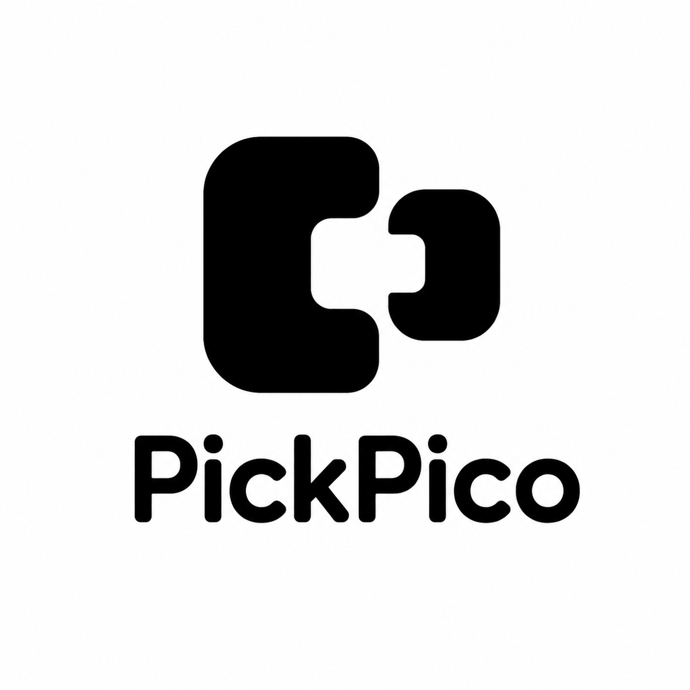

<p align="center">
  <picture>
    <source media="(prefers-color-scheme: dark)" srcset="app/src/main/res/icon1.png">
    <source media="(prefers-color-scheme: light)" srcset="app/src/main/res/icon2.png">
    
  </picture>
</p>

# PickPico

> **Give your agent a phone.**

**讓 AI 看見現場、操作手機、執行程式，遇到難題直接找你。**

PickPico 把 Android 手機變成 AI Agent 能使用的行動工具。接上支援 MCP 的 Agent，就能透過手機拍照、操作 App、執行小程式；遇到需要人類的步驟，直接向手機旁的人求助，收到回覆後繼續工作。

**你的手機，成為 Agent 走進真實世界的入口。**

FUTUREMODE × SITCON Hackathon 2026 · AI Agents & Automation

## PickPico，讓 Agent 能夠辦到的事情

| 能力 | 能做什麼 | 你可以怎麼用 |
| --- | --- | --- |
| 👀 **看現場** | 相機、錄音、位置、螢幕擷取 | 「幫我設定 1 分鐘後拍照，人走到定位後，發出語音倒數 3、2、1 後拍照。」 |
| 👆 **動手機** | 開啟 App、點擊、輸入、捲動、語音播報 | 「幫我打開 UBER APP，填好上下車地點後停在送出前讓我確認。」 |
| ⚙️ **跑程式** | 讀寫檔案、執行指令、啟動 Node.js 程式 | 「幫我在手機上寫一個小工具，執行後把結果告訴我。」 |
| 🙋 **找人幫忙** | 發出求助、接收文字與照片、等待回覆 | 「這一步需要你確認，我把問題送到手機上。」 |

手機本來就是一個有相機、麥克風、螢幕、網路與電池的邊緣運算裝置，而且距離我們最近。PickPico 想把這些能力接進 Agent 的工作流程。

## HUMAN HELP

例如，你可以請 Agent 協助檢查設備：

1. Agent 透過手機拍攝設備面板。
2. 畫面看不清楚，Agent 發出求助：「請靠近面板拍一張照片。」
3. 手機旁的人開啟請求，拍照並回覆。
4. Agent 收到照片，接著完成判讀與後續工作。

你可以回覆文字、點選選項、選擇照片，或直接拍攝現場。操作期間會延長等待時間，讓你有時間把事情做好。

**人類的協助，直接接回原本的任務。**

## 人在國外度假，沒有帶 NB，卻臨時有緊急需求要開發

搭配 Pico 手機架與 BLE 實體按鈕，手機可以成為隨手可用的 Agent 終端。

Agent 可以在手機的工作空間裡寫入檔案、執行指令，或啟動 Node.js 小工具，也支援背景程序與檔案管理。Agent 可以把小型自動化、機器人或工具程式放到手機上執行。

手機既是操作入口，也能是實際執行工作的裝置。需要你補充資訊時，再透過 HUMAN HELP 找你。

從提出需求、執行程式到回覆問題，都能圍繞這支手機完成。

PickPico 透過鄰近的藍芽連線能力與 PICO 手機架配對。

四顆按鈕為：**允許／拒絕／細節／語音輸入**。

**按住說話、放開確認，把需求交給 Agent。**

*手機架與實體按鈕為選配。*

```text
交代需求 → Agent 寫入程式 → 手機執行 → 取得結果
```

程式在 PickPico 的 App 私有空間內執行，使用 Android 允許的資源與權限。

## 日常手機，也能交給 Agent 幫忙

**不需要 Root，也不用開啟 ADB／USB 偵錯。**

不必為了讓 AI 操作手機，額外開啟可能觸發銀行 App 安全檢查的設定。

PickPico 使用 Android 提供的權限與服務。你可以在 App 裡選擇開放哪些能力，需要進一步操作畫面時，再啟用 **Hyper Mode** 並完成系統授權。

- 相機、麥克風、位置等能力，由 Android 權限管理。
- 畫面操作、通知存取與螢幕擷取，需要另外授權。
- PIN、圖形、指紋等解鎖驗證，仍由 Android 處理。
- 檔案與程式在 PickPico 的 App 私有空間內運作。

## 開始使用

準備一支 **Android 8.0 以上、ARM64 架構的手機**，以及支援遠端 MCP 連線的 Agent。

1. 安裝並開啟 PickPico。
2. 啟動服務，依需求開放手機能力。
3. 複製 App 顯示的 MCP 連線資訊，加入你的 Agent。
4. 確認連線後，試著交代第一個任務：

> 「看看這支手機現在有哪些能力，再幫我用前鏡頭拍一張照片。」

需要操作 App 畫面時，請先在 PickPico 開啟 Hyper Mode，並依提示完成授權。

連線設定請見 [遠端連線指南](docs/remote-access-setup.md)。

## 在同一個網路，或隔著網路使用

PickPico 支援區域網路直連，也能透過自行部署的 Relay 讓遠端 Agent 使用手機。

**本專案不提供公共 Relay。** 遠端使用前請先依 [Relay 部署說明](relay/README.md) 準備自己的服務。

```text
區域網路：Agent ─────────────→ PickPico

遠端連線：Agent → Cloudflare Relay ← PickPico
```

手機會主動連上 Relay，不需要設定公開 IP、路由器連接埠轉發或 VPN。

**連線資訊含有存取憑證，請只交給你信任的 Agent，不要公開貼出。**

傳輸方式與自架說明請見 [遠端架構文件](docs/remote-transport.md)。

## 能力很多，Agent 需要時再找

PickPico 透過 MCP 提供穩定的探索與執行入口。Agent 先搜尋任務需要的能力，再確認狀態並呼叫。

```text
「看看手機畫面」
       ↓
搜尋螢幕相關能力
       ↓
確認是否已授權
       ↓
擷取畫面或讀取介面元素
       ↓
依結果繼續工作
```

除了相機、畫面操作與程式執行，也支援：

- 聯絡人查詢、行事曆讀寫。
- 通知讀取、通知按鈕與回覆。
- 系統檔案與照片選取器。
- 語音播報、音量控制與手機喚醒。
- Android 分享面板。
- 跨步驟任務的建立與進度追蹤。
- 檢查更新、下載與驗證 APK，再交由 Android 安裝。

圖片等內容的顯示方式，取決於所使用的 MCP 客戶端。

## 開發與展示

PickPico 由 Android App、Cloudflare Relay，以及選配的 BLE 按鈕韌體組成。

| 目錄 | 內容 |
| --- | --- |
| `app/` | Android App 與手機能力 |
| `relay/` | 遠端連線服務 |
| `firmware/` | BLE 實體按鈕韌體 |
| `docs/` | 設計、設定與展示文件 |
| `scripts/` | 建置、驗證與發布工具 |

- [完整展示流程](docs/demo-runbook.md)
- [遠端傳輸與安全設計](docs/remote-transport.md)
- [產品與能力規格](docs/product-spec-v0.1.md)

主要技術：MCP、Android、Node.js、Cloudflare Workers、Durable Objects、BLE。

本專案使用 AI coding agents 協助開發與測試；產品設計、整合與驗證由團隊負責。
