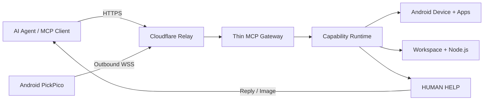

# PickPico

> **Give your agent a phone.**

Turn any Android phone into an AI Agent's **eyes, hands, runtime, and human connection**.

PickPico 把 Android 手機變成可被 AI Agent 使用的 **Mobile Agent Node**。Agent 能透過手機看見現場、理解畫面、操作 App、執行程式；遇到需要人類的步驟時，**HUMAN HELP** 會把任務交給手機旁的人，拿到回覆後繼續工作。

PickPico 想解一個很直接的問題：

> **AI Agent 已經活在雲端裡了，怎麼讓它跨進真實世界？**

FUTUREMODE × SITCON Hackathon 2026 · AI Agents & Automation

##簡介

AI Agent 已經很會用瀏覽器、程式碼和 Cloud API，卻很難碰到身邊的世界。

Android 手機本身就是一台完整的 edge computer。它能看、能聽、知道自己在哪裡，也有螢幕、網路、電池和各種 App；更重要的是，手機通常就在人的身邊。

PickPico 透過 MCP 把這支手機接進 Agent 的工作流程，讓 Agent 可以直接使用它的感知、操作、運算與人類協助能力。

## 為什麼是 PickPico

多數 Agent 工具替 AI 增加更多可以呼叫的能力。PickPico 把 Agent 的執行邊界延伸到一支真實世界裡的 Android 手機，並搭配手機架與實體按紐達成不需要PC也能運行的小型開發環境，同時手機有任何問題，需要請AGENT協助時，不須ROOT/ADB開發者模式，不須擔心無法使用銀行轉帳等問題。

> **Most Agent tools extend what an AI can call. PickPico extends where an AI can exist.**

這支手機會成為一個 **Mobile Agent Node**：Agent 可以透過它感知環境、操作 App、執行程式，必要時把任務交給附近的人。

```text
AI Agent
   │
   │ MCP
   ▼
PickPico
   ├─ Sense   → camera / mic / location / screen / notifications
   ├─ Act     → apps / UI / notification / speech / share sheet
   ├─ Run     → workspace / shell / background process / Node.js
   └─ Ask     → HUMAN HELP → nearby human
```

## PickPico 能做什麼

| 類別 | 已實作能力 |
| --- | --- |
| **Sense** | 相機拍照、麥克風錄音、GPS、螢幕擷取、通知讀取、Accessibility UI tree |
| **Act** | App 啟動、網址 / deep link、點擊、輸入、捲動、剪貼簿、通知、TTS、響鈴、喚醒 |
| **Personal data** | 聯絡人查詢、行事曆讀寫、通知 action / reply |
| **Files & media** | 系統 File Picker、Photo Picker、PickPico 私有 workspace、Android Share Sheet |
| **Run** | App sandbox 內 shell、背景程序、內嵌 Node.js runtime |
| **Human** | HUMAN HELP：文字、選項、相簿選圖、現場拍照、可續時等待 |
| **Long tasks** | 建立、更新與追蹤跨多個 command / human handoff 的 Agent task |
| **Remote** | 跨 Wi-Fi / 行動網路使用 |
| **self Update** | 遠端檢查新版、下載 APK、驗證後交給 Android installer |

### Core Mode / Hyper Mode

PickPico 把高權限能力集中在 **Hyper Mode**。手機持有者必須在 Android 系統設定中明確開啟對應權限。

目前 Hyper 能力包含：

- Accessibility UI inspect / click / type / scroll
- active notifications read / action / reply
- MediaProjection screen capture
- Device Admin phone lock
- urgent full-screen Agent handoff
- 在 Hyper Mode 開啟時請 Android 嘗試 dismiss keyguard

Keyguard dismissal 仍由 Android 決定，PIN、圖形、指紋等安全驗證維持系統原本的規則。

## 核心 Demo

### 1. Agent 卡住時，不要死轉圈，直接叫人

PickPico 的 **HUMAN HELP** 是 Agent 面對真實世界阻礙時的標準出口。

例如 Agent 遠端維護設備時需要知道「面板綠燈到底有沒有亮」，與其反覆猜測，它可以直接把任務交給手機旁的人：

```json
{
  "commandId": "human.help",
  "arguments": {
    "title": "請協助確認設備狀態",
    "instruction": "請看面板上的綠燈是否亮起；如果不確定，可以直接拍照。",
    "actions": ["綠燈有亮", "沒有亮", "無法確認"],
    "allowTextReply": true,
    "allowImages": true,
    "maxImages": 3,
    "idleTimeoutSeconds": 180
  }
}
```

使用者開啟任務、輸入文字、選照片或拍照時都會更新 idle timer，避免人類正在幫忙時 request 卻先死掉。

### 2. Pocket Worker：讓閒置手機本身成為 Agent 的運算節點

Agent 可以在 PickPico 私有 workspace 寫檔、執行 shell，或啟動一個長駐 Node.js entry point。

承載小型 automation、bot 或 utility，直接成為實際執行節點。

```text
Agent → workspace.write → node.start → Android phone keeps the workload alive
```

### 3. 沙發 Vibe Coding

PickPico 也有 BLE button bridge，可搭配 Pico 手機架 / 實體按鈕，把手機變成 Agent 的隨身終端：按住說話、放開確認，再把語音需求送進 Agent。

坐在沙發上也能叫 Agent 寫程式。手機本身就是入口。 📱🛋️

### 4. 手機端小模型 + PickPico

PickPico 的 MCP capability layer 與上層模型解耦。架構上可以讓 4B 級左右的手機端模型使用同一組 capabilities，變成真正能操作這支手機的 local assistant。

> 這是目前的延伸方向；PickPico APK 尚未內建特定本地模型。

## 系統架構



手機主動建立 outbound connection，所以不需要 public IP、port forwarding 或 VPN。

```text
Remote: Agent ─HTTPS→ Cloudflare Relay ←WSS─ PickPico
Local:  Agent ─HTTP + Bearer→ Android :8765/mcp
```

目前 reference Relay：

```text
https://relay.pickpico.workers.dev
```

## 為什麼 MCP 工具只有少數幾個

PickPico 將公開的 `/v3` thin profile 收斂成 10 個穩定入口，手機能力則由 Agent 在需要時動態探索：

```text
server_info
capability_search
capability_status
policy_status
command_run
command_status
task_runtime_info
task_create
task_update
task_status
```

Agent 需要能力時才搜尋：

```text
capability_search("看看現在手機畫面")
  → screen.capture / ui.inspect

command_run("screen.capture")
  → native MCP image
```

這樣新增手機能力時不必一直膨脹 tool list，也降低模型在一大排相似工具裡選錯的機率。

舊版 `/v1`、`/v2` 仍保留較完整的 tool surface 以維持相容性。

## 安全邊界

PickPico 的能力受 Android 原生權限與明確的 owner policy 約束。

| 能力 | 邊界 |
| --- | --- |
| 相機、麥克風、位置、聯絡人、行事曆 | 依 Android runtime permission 管理 |
| 通知存取 | 必須由使用者在 Android 設定中開啟 Notification Listener |
| Hyper UI | 必須由使用者親自在系統設定中啟用 Accessibility Service |
| Screen capture | 必須取得 Android MediaProjection 授權 |
| Phone lock | 必須先啟用 Device Admin |
| Hyper unlock | 只要求 Android dismiss keyguard，不繞過 secure authentication |
| Shell / Node.js | 僅在 PickPico App sandbox 內執行，沒有 root 或 ADB 權限 |
| HUMAN HELP | 回覆與圖片保存在 App 私有儲存空間 |
| Local MCP | 使用 Bearer token |
| Remote MCP | 高熵 capability URL、Relay secret 與 local Bearer 分開管理 |
| Self update | 驗證 SHA-256、package name、簽章與版本後才交給 Android installer |

**遠端 capability URL 本身等同憑證，不應公開分享。**

## 連線方式

### Local

1. 手機與 MCP Client 位於相同的可信任網路。
2. 開啟 PickPico，啟動 Node。
3. 複製 App 顯示的 MCP Connection JSON 到 Client。

### Remote Relay

1. Relay URL 使用 `https://relay.pickpico.workers.dev`。
2. 啟動 Node，等待 Relay 顯示 connected。
3. 複製 Remote MCP Connection JSON 到 Client。
4. 手機之後可在 Wi-Fi / 行動網路間切換並自動重連。

更完整的傳輸、安全設計與自架說明：[`docs/remote-transport.md`](docs/remote-transport.md)

## Build


需求：

- Java 17
- Gradle 8.7
- Android SDK 35
- Android NDK `27.3.13750724`
- CMake `3.22.1`
- Android 8.0+ / `arm64-v8a`

第一次 build 會下載 `nodejs-mobile 18.20.4`，並在解壓前驗證固定 SHA-256。

```powershell
gradle :app:testDebugUnitTest :app:assembleDebug
```

APK：

```text
app\build\outputs\apk\debug\app-debug.apk
```

## Hackathon readiness

```powershell
# Build + unit tests + APK + Relay health
pwsh scripts/hackathon-readiness.ps1

# 加上真實 Android MCP Node
pwsh scripts/hackathon-readiness.ps1 -Device

# 再加 HUMAN HELP 完整 round trip
pwsh scripts/hackathon-readiness.ps1 -Device -HumanHelp
```

完整展示流程：[`docs/demo-runbook.md`](docs/demo-runbook.md)

## 專案結構

```text
MCPocket/
├─ app/                         Android PickPico
├─ relay/                       Cloudflare Worker + Durable Object
├─ firmware/
│  └─ pickpico-button-pad/      BLE physical button pad
├─ docs/
│  ├─ product-spec-v0.1.md      Product / capability spec
│  ├─ remote-transport.md       Remote transport & security
│  ├─ remote-access-setup.md    Remote setup
│  └─ demo-runbook.md           Hackathon demo flow
└─ scripts/                     Build / validation / publishing
```

## Tech

- Model Context Protocol
- Android SDK / AndroidX
- OkHttp
- nodejs-mobile
- Cloudflare Workers / Durable Objects / Workers KV
- BLE
- JUnit

本專案使用 AI coding agents 協助開發與測試；產品設計、整合與驗證由團隊負責。第三方元件各自適用其原始授權條款。

## License

