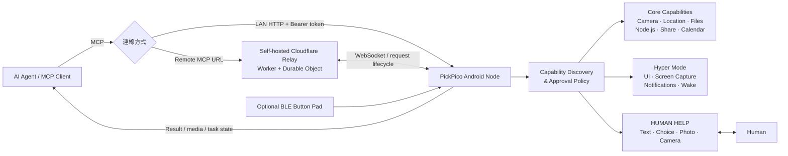

<p align="center">
  <picture>
    <source media="(prefers-color-scheme: dark)" srcset="app/src/main/res/icon1.png">
    <source media="(prefers-color-scheme: light)" srcset="app/src/main/res/icon2.png">
    
  </picture>
</p>

# PickPico

> **Give your agent a phone.**

**讓 AI 看見現場、操作手機、執行程式，遇到難題直接找你。**

FUTUREMODE × SITCON Hackathon 2026 · **AI Agents & Automation**

## 問題與目標

今天的 AI Agent 已經可以寫程式、查資料、操作雲端服務，卻常在碰到真實世界的最後一公尺時停下來。

它可能需要看一眼設備面板、拍一張照片、讀取手機通知、打開 App 完成幾個操作，甚至只需要請旁邊的人按一下按鈕。這些事情對人類來說很簡單，對只活在瀏覽器或伺服器裡的 Agent 卻可能變成任務中斷點。

**PickPico 把 Android 手機變成 AI Agent 可以直接使用的行動節點。**

手機本來就有相機、麥克風、定位、螢幕、網路、電池與運算能力，而且通常就在使用者身邊。PickPico 透過 MCP 把這些能力接進 Agent 的工作流程，讓 Agent 能自行探索手機目前可用的能力、執行操作，必要時再把最適合由人完成的那一步交給人類。

```text
AI Agent
   │
   ├─ 看見現場
   ├─ 操作手機
   ├─ 在手機上執行程式
   └─ 需要時向人類求助
            │
            └─ 回覆後繼續原本任務
```

PickPico 的目標不是做另一個「遠端遙控手機」工具，而是讓手機成為 **Agent 走進真實世界的入口**。

## 核心功能

| 能力 | 能做什麼 | 使用情境 |
| --- | --- | --- |
| 👀 **看現場** | 相機、錄音、位置、螢幕擷取 | 「1 分鐘後拍照，人走到定位後，發出語音倒數 3、2、1 再拍照。」 |
| 👆 **動手機** | 開啟 App、點擊、輸入、捲動、語音播報 | 「打開 Uber，填好上下車地點，停在送出前讓我確認。」 |
| ⚙️ **跑程式** | 讀寫檔案、執行指令、啟動 Node.js 程式 | 「在手機上寫一個小工具，執行後把結果告訴我。」 |
| 🙋 **HUMAN HELP** | 發出求助、接收文字／選項／照片／相機回覆 | Agent 判斷某一步讓旁邊的人處理更快時，把完整操作需求交給人類，再接續任務。 |
| 🧭 **動態能力探索** | Agent 先搜尋能力、確認可用狀態與輸入格式，再執行 | 不需要把數十個手機工具一次塞進模型 context。 |
| 🛡️ **Core / Hyper Mode** | 將一般手機能力與高權限畫面操作分層 | 只有真的需要 UI 操作、通知存取或螢幕擷取時才開啟進階權限。 |

### HUMAN HELP：讓人類成為工作流程的一部分

例如，請 Agent 協助檢查設備：

1. Agent 透過手機拍攝設備面板。
2. 畫面看不清楚，Agent 判斷讓附近的人補拍最有效率。
3. PickPico 發出求助：「請靠近面板拍一張照片。」
4. 手機旁的人直接拍照並回覆。
5. Agent 收到照片，繼續判讀與後續工作。

人類可以回覆文字、點選選項、選擇照片，或直接拍攝現場；操作期間會自動延長等待時間。

**HUMAN HELP 不是任務的終點，而是 Agent 可以主動使用的一個能力。**

### 手機也能成為 Agent 的執行環境

PickPico 內建 Node.js Mobile runtime。Agent 可以在 App 私有工作空間寫入檔案、執行指令、啟動 Node.js 小工具，也支援背景程序與檔案管理。

```text
交代需求 → Agent 寫入程式 → 手機執行 → 取得結果
```

例如人在外面、沒有筆電，卻臨時需要一個小型自動化工具時，Agent 可以直接把程式放到手機上執行。手機既是操作入口，也可以是實際工作的裝置。

### 不需要 Root，也不用開 ADB

PickPico 使用 Android 正式提供的權限與服務，不要求 Root，也不需要開啟 ADB／USB 偵錯。

- 相機、麥克風、位置等能力由 Android 權限管理。
- 畫面操作、通知存取與螢幕擷取需另外授權。
- PIN、圖形、指紋等裝置解鎖驗證仍由 Android 處理。
- 檔案與程式在 PickPico 的 App 私有空間內運作。
- 高權限操作集中在 **Hyper Mode**，由使用者明確啟用。

### 選配：Pico 手機架與 BLE 實體按鈕

PickPico 也能搭配手機架與 BLE 實體按鈕，讓手機成為隨手可用的 Agent 終端。

四顆按鈕為：**允許／拒絕／細節／語音輸入**。

**按住說話、放開確認，把需求交給 Agent。**

手機架與實體按鈕為選配，不影響 PickPico 的 MCP 核心功能。

## 系統架構



### 動態能力探索

PickPico 不把所有手機工具一次暴露給 Agent，而是提供穩定的能力探索與執行入口。Agent 先搜尋任務需要的能力，再確認狀態、權限與輸入格式後呼叫。

```text
「看看手機畫面」
       ↓
搜尋螢幕相關能力
       ↓
確認目前是否已授權
       ↓
擷取畫面或讀取介面元素
       ↓
依結果繼續工作
```

目前能力包含相機、麥克風、位置、UI 操作、螢幕擷取、通知、聯絡人、行事曆、分享面板、檔案／照片選取、語音播報、音量、手機喚醒、Node.js 程式執行，以及跨步驟 Agent task 狀態管理等。

### Local 與 Remote

```text
區域網路：Agent ─────────────→ PickPico

遠端連線：Agent → Cloudflare Relay ← PickPico
```

手機會主動連上 Relay，因此不需要公開 IP、路由器 port forwarding 或 VPN。

**本專案不提供公共 Relay。** 遠端使用需自行部署，完整 MCP URL 本身具有存取能力，請勿公開分享。

更多設計細節：

- [遠端連線指南](docs/remote-access-setup.md)
- [遠端傳輸與安全設計](docs/remote-transport.md)
- [產品與能力規格](docs/product-spec-v0.1.md)

## 使用技術

| 類型 | 技術／服務 | 用途 |
| --- | --- | --- |
| AI / Agent | MCP-compatible Agent；本次開發與展示使用 OpenAI ChatGPT / Codex | 規劃任務、探索能力與呼叫手機工具 |
| Protocol | Model Context Protocol (MCP) | Agent 與 PickPico 的標準工具介面 |
| Android | Java、Android SDK 35、Accessibility、MediaProjection、Foreground Service 等 | 手機能力、權限與 UI 操作 |
| On-device runtime | Node.js Mobile 18.20.4 | 在 App 私有空間執行 Node.js 程式 |
| Networking | OkHttp、HTTP、WebSocket | Local MCP 與 Relay 長連線 |
| Backend | Cloudflare Workers、Durable Objects、KV | 遠端 Relay、Node lifecycle 與更新資料 |
| Hardware | BLE | 選配 Pico 實體按鈕 |
| Sponsor 技術 | OpenAI ChatGPT / Codex | Agent client、開發與實機測試；PickPico runtime 本身不綁定單一模型供應商 |

## 安裝與執行

### 方式一：直接安裝 APK

準備：

- Android 8.0（API 26）以上
- ARM64 (`arm64-v8a`) 裝置
- 支援 MCP 連線的 Agent / Client

步驟：

1. 安裝 PickPico APK 並開啟 App。
2. 在首頁啟動 Node service。
3. 依任務需求開放相機、位置等 Android 權限。
4. 需要操作手機 UI、讀取通知或擷取螢幕時，再啟用 **Hyper Mode** 並依畫面完成系統授權。
5. 選擇 Local 或 Remote 連線方式。
6. 將 App 顯示的 MCP 連線資訊加入 Agent。
7. 先呼叫 `server_info`，再請 Agent 搜尋手機能力並執行第一個任務。

建議第一個測試：

> 「看看這支手機現在有哪些能力，再幫我用前鏡頭拍一張照片。」

完整設定流程見 [PickPico 連線指南](docs/remote-access-setup.md)。

### 方式二：從原始碼建置 Android App

建置需求：

- JDK 17
- Gradle 8.7
- Android Gradle Plugin 8.5.2
- Android SDK 35
- Android NDK `27.3.13750724`
- CMake 3.22.1
- 可連線下載 Node.js Mobile runtime

目前 repository 未內含 Gradle Wrapper；請使用本機 Gradle 8.7 或 Android Studio 對應環境。

Debug build 需要 Android debug keystore：

```powershell
gradle "-PpickpicoDebugKeystore=$env:USERPROFILE\.android\debug.keystore" `
  :app:testDebugUnitTest :app:assembleDebug
```

輸出 APK：

```text
app/build/outputs/apk/debug/app-debug.apk
```

建置期間會下載官方 Node.js Mobile 18.20.4 Android runtime，並驗證 SHA-256 後才解壓使用。

### 部署自己的 Remote Relay

遠端使用需要自己的 Cloudflare Workers 環境與 KV namespace：

```bash
cd relay
npm ci
npx wrangler login
```

接著：

1. 複製 `relay/wrangler.jsonc` 為 `relay/wrangler.local.jsonc`。
2. 建立自己的 KV namespace，填入對應 ID。
3. 保留 Durable Object `NODE_RELAY` 綁定與 migration。
4. 部署：

```bash
npx wrangler deploy --config wrangler.local.jsonc
```

5. 將部署後的 HTTPS 基底網址填入 PickPico 的 **Remote Access**。
6. 等待 App 顯示 `CONNECTED`，再從 Agent 呼叫 `phone.status` / capability tools 驗證完整鏈路。

詳細說明見 [Relay 自行部署文件](relay/README.md)。

## 作品展示

- Repository：<https://github.com/mabyes1/PickPico>
- 完整展示流程：[docs/demo-runbook.md](docs/demo-runbook.md)
- 評選影片：**待補上 YouTube 連結**

### Demo 建議情境

1. Agent 動態搜尋 PickPico 能力，不事先知道所有手機工具。
2. 透過手機取得真實世界資訊或操作 App。
3. 任務遇到適合人類完成的步驟時，自主呼叫 HUMAN HELP。
4. 人類在手機上回覆後，Agent 從原本 task 繼續。
5. 展示手機不只是遙控終端，也能直接執行 Agent 寫入的小型 Node.js 程式。

## 限制與未來工作

### 目前限制

- 目前 Android App 僅支援 Android 8.0+、ARM64；尚未支援 iOS。
- UI 操作、通知存取與螢幕擷取受 Android 權限與前景執行限制，部分操作仍需要使用者先完成系統授權。
- PickPico 不繞過 Android PIN、圖形、指紋或其他鎖屏安全機制。
- Remote Relay 目前提供 Cloudflare Worker + Durable Object 實作，尚未提供可直接部署的 Docker / Node.js server 版本。
- 不同 MCP Client 對圖片、音訊與互動內容的呈現能力不同。
- 本專案不提供公共 Relay，遠端使用者必須自行部署並管理存取網址。

### 未來工作

- 提供更通用的 self-hosted Relay / Docker 部署方式。
- 建立 capability extension SDK，讓 App 或硬體能力可以被第三方擴充。
- 強化離線與 local LLM 情境，讓手機本身可以同時成為 Agent runtime 與 physical interface。
- 擴充 BLE / 感測器／硬體節點，讓 Agent 不只「有一支手機」，也能逐步取得更多實體世界介面。
- 改善跨裝置 task persistence、斷線恢復與長時間 Agent 工作流程。

#### Android 原生 OpenAI Tunnel

PickPico 現在使用自行部署的 Relay，讓手機可以獨立連上網路並被遠端 Agent 使用，同時保持對不同 MCP Client 與模型供應商的相容性。

OpenAI Secure MCP Tunnel 提供另一條路徑：對 ChatGPT 使用者而言，可以省去自行部署公開 Relay 的需求。不過目前官方 Tunnel Client 主要運行在電腦或伺服器環境；若透過電腦中轉，會重新引入 PickPico 想移除的常駐電腦依賴。

因此未來希望能在 **Android 端直接實作 OpenAI Tunnel 相容的 transport**：

```text
ChatGPT → OpenAI Tunnel → PickPico Android
```

這樣 ChatGPT 可以在 **不需要自架 Cloudflare Relay，也不需要另一台常駐電腦** 的情況下直接使用手機；現有 PickPico Relay 則繼續保留，提供其他 MCP Client 與本地模型使用。

目標不是把 PickPico 綁定單一平台，而是讓 Agent 可以依環境選擇最適合的 transport。

## 第三方服務、資料與素材

本專案不應提交 API key、Token、個人 Relay URL 或其他私人憑證。

| 項目 | 來源 | 用途／授權說明 |
| --- | --- | --- |
| Model Context Protocol | <https://modelcontextprotocol.io/> | Agent 工具協定；依官方規格與授權使用 |
| Android / AndroidX | <https://developer.android.com/> | Android App 與 Jetpack 元件；依 Android / AndroidX 個別授權 |
| Node.js Mobile | <https://github.com/nodejs-mobile/nodejs-mobile> | Android 內嵌 Node.js runtime；依上游專案授權使用，建置時驗證固定版本 SHA-256 |
| OkHttp | <https://square.github.io/okhttp/> | HTTP / WebSocket client；Apache License 2.0 |
| Cloudflare Workers / Durable Objects / KV | <https://developers.cloudflare.com/> | Self-hosted Remote Relay 與更新資料；依 Cloudflare 服務條款使用 |
| Wrangler | <https://developers.cloudflare.com/workers/wrangler/> | Relay 開發與部署工具；依上游專案授權使用 |
| JUnit 4 | <https://junit.org/junit4/> | Android JVM unit tests；依上游專案授權使用 |

PickPico Logo、產品文案與本專案自製介面素材由團隊製作。若使用第三方 App、服務或裝置進行 Demo，其商標與內容權利仍屬原權利人。

## 團隊成員

| 姓名 | 分工 |
| --- | --- |
| Ken Huang (`@mabyes1`) | Product design、Android / MCP / Relay integration、Agent workflow、testing |
| Kate Li（凱特李）<br>`kateli02022024@gmail.com` | Frontend UI/UX design、PICO 實體手機架設計 |

本專案使用 AI coding agents 協助開發、程式審閱與測試；產品方向、整合、實機驗證與最終決策由團隊負責。

## Repository 結構

| 目錄 | 內容 |
| --- | --- |
| `app/` | Android App 與手機 capabilities |
| `relay/` | Cloudflare Remote Relay |
| `firmware/` | BLE 實體按鈕韌體 |
| `docs/` | 產品、架構、設定與 Demo 文件 |
| `scripts/` | 建置、驗證與發布工具 |

## License

PickPico 採用 **AGPL-3.0 + Commercial Dual License**。

- 開源使用、修改與散布：依 **GNU Affero General Public License v3.0 (AGPL-3.0)**，完整條款見 [LICENSE](LICENSE)。
- 若要在不受 AGPL-3.0 copyleft 義務約束的專有／閉源產品或服務中使用、修改或整合 PickPico，請另行取得商業授權，詳見 [COMMERCIAL-LICENSING.md](COMMERCIAL-LICENSING.md)。

第三方元件仍依各自原始授權條款使用。
