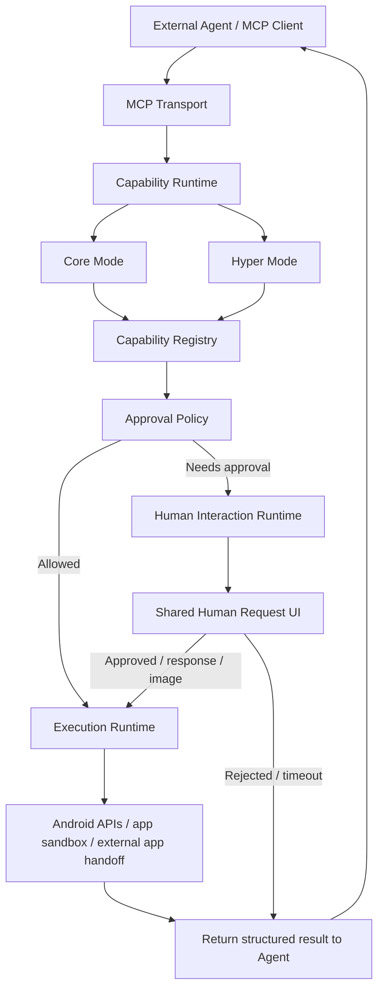
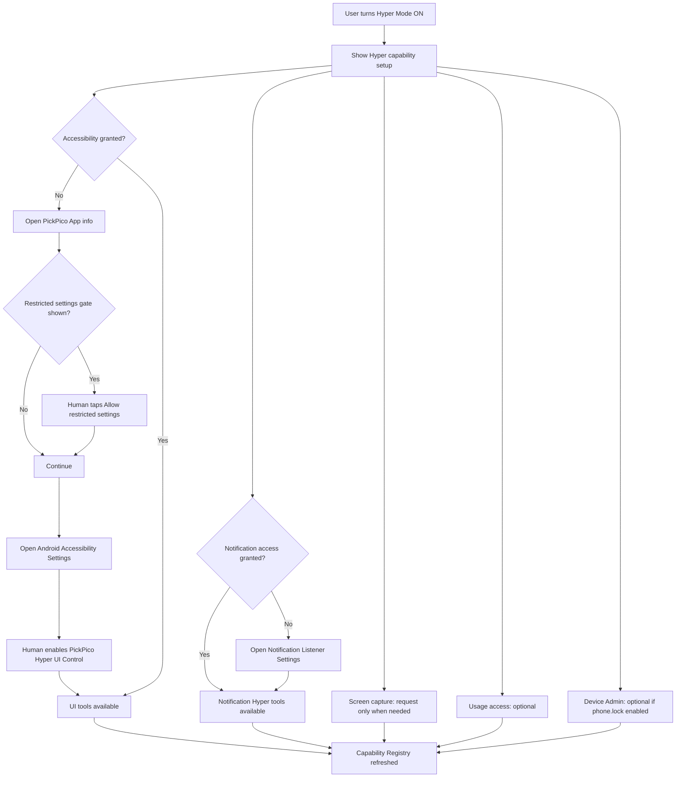
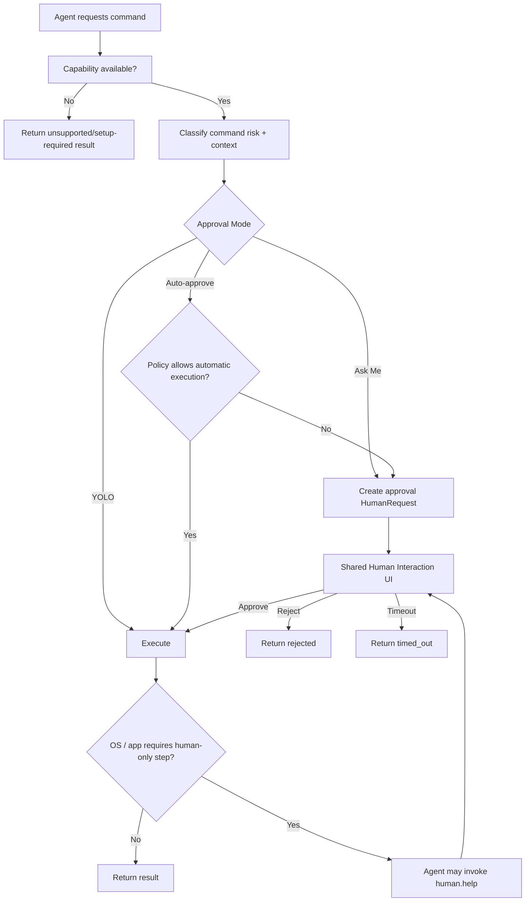
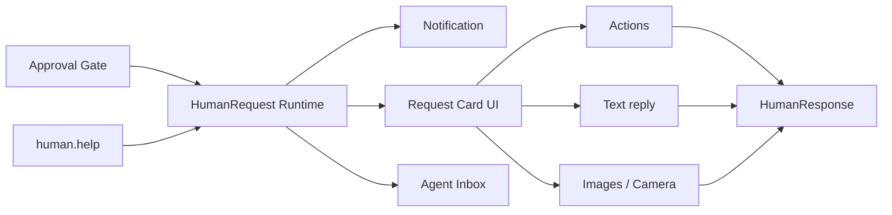
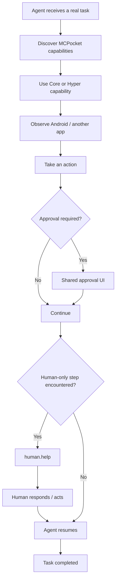

# MCPocket Product Spec v0.1

> Status: Draft / Hackathon development spec  
> Platform strategy: **Android-first Full Mobile Agent Node**  
> Future iOS strategy: **Capability-limited Mobile Agent Companion**  
> Scope: capability model, permissions, Hyper Mode, approval policy, Human Interaction UI, platform boundaries

## 1. Product definition

MCPocket turns a phone into an MCP-capable Agent node.

The product is intentionally split into two capability layers:

- **Core Mode**: ordinary app-level capabilities that should remain portable where possible.
- **Hyper Mode**: Android special-access, cross-app, screen, notification, or device-control capabilities.

The two layers answer only one question:

> **Can this phone perform the requested capability?**

They do **not** decide whether the Agent is allowed to perform it automatically. That is handled by a separate Approval Policy.

```text
Capability layer = what the phone CAN do
Approval policy  = what the Agent MAY do without asking
Human interaction = what a person must approve or physically complete
```

## 2. Product architecture



### Architecture rule

`Hyper Mode` and `Approval Mode` must remain independent.

Examples:

- Hyper Mode ON + Ask Me: UI automation exists, but side-effect actions still ask first.
- Hyper Mode ON + YOLO: MCPocket adds no extra approval prompt, but Android / biometric / Wallet / OS security boundaries still apply.
- Hyper Mode OFF + YOLO: Agent still cannot use Hyper-only capabilities because the capability does not exist in the exposed registry.

## 3. Capability lifecycle

Every capability should eventually expose runtime availability, not only static schema discovery.

Proposed state model:

```json
{
  "id": "screen.capture",
  "group": "hyper",
  "platform": "android",
  "supported": true,
  "enabled": false,
  "available": false,
  "requiresSetup": true,
  "setupType": "media_projection",
  "userInteractionRequired": true,
  "risk": "screen_read"
}
```

Recommended runtime states:

| State | Meaning |
| --- | --- |
| `unsupported` | This platform/build cannot provide the capability |
| `disabled` | Feature exists, but Core/Hyper policy has disabled it |
| `setup_required` | User must grant Android permission or Special Access |
| `available` | Capability can currently run |
| `temporarily_unavailable` | Runtime condition blocks it, such as no foreground activity |

### Current MCP surface

Implemented in the current Phase A runtime:

- `capability.list`
- `capability.status`

`command_list` remains the execution catalog. `capability.*` explains why a command is or is not currently usable.

## 4. Core Mode

Core Mode contains capabilities that do not depend on Android Accessibility or another highly privileged cross-app access mechanism.

### 4.1 Existing Core capabilities

| Capability | Current command | Status | Notes |
| --- | --- | --- | --- |
| Node info | `node.info` | ✅ implemented | Device / runtime metadata |
| Phone status | `phone.status` | ✅ implemented | Battery, network, storage, permissions |
| Camera | `camera.capture` | ✅ implemented | Runtime CAMERA permission |
| Microphone | `microphone.record` | ✅ implemented | Runtime RECORD_AUDIO permission |
| Location | `location.get` | ✅ implemented | Coarse/fine location permission |
| Notify human | `phone.notify` | ✅ implemented | Own app notification |
| TTS | `phone.speak` | ✅ implemented | Android TTS |
| Ring | `phone.ring` | ✅ implemented | Observable device action |
| Wake screen | `phone.wake` | ✅ implemented | Does not unlock |
| HUMAN HELP | `human.help` | ✅ implemented | Text / actions / images / camera |
| App launch | `app.launch` | ✅ implemented | Launchable package only |
| Deep link / URL | `url.open` | ✅ implemented | Web, geo, wallet/deep-link handoff |
| Clipboard | `clipboard.get/set` | ✅ implemented | Subject to Android clipboard restrictions |
| Workspace files | `workspace.*` | ✅ implemented | App-private storage only |
| Shell runtime | `process.exec/output/stop` | ✅ implemented | App UID sandbox, not root |
| Embedded Node.js | `node.start/status/stop` | ✅ implemented | App-private runtime |
| Agent tasks | `task_*` | ✅ implemented | Long-running Agent lifecycle |
| Self-update | `app.update_*` | ✅ implemented | Android package installer remains final boundary |

### 4.2 Core capabilities still to develop

#### P0: required for a convincing Mobile Agent product

| Planned capability | Proposed MCP surface | Permission / boundary | Android | Future iOS |
| --- | --- | --- | ---: | ---: |
| Capability discovery | `capability.list/status` | none | ✅ | ✅ |
| Contacts | `contacts.search/get` | Contacts permission | ✅ | ✅ |
| Calendar read | `calendar.list/get` | Calendar permission | ✅ | ✅ |
| Calendar write | `calendar.create/update/delete` | Calendar permission + Approval Policy | ✅ | ✅ |
| File picker | `file.pick` | User-mediated system picker | ✅ | ✅ |
| Media picker | `media.pick` | User-mediated photo/video picker | ✅ | ✅ |
| Share sheet | `share.send` | User/app handoff | ✅ | ✅ |

#### P1: useful device capabilities

| Planned capability | Proposed MCP surface | Permission / boundary | Android | Future iOS |
| --- | --- | --- | ---: | ---: |
| Flashlight | `flashlight.set` | Camera/torch availability | ✅ | ✅ |
| Sensors | `sensor.snapshot` | Device-dependent | ✅ | ✅ partial |
| Bluetooth discovery | `bluetooth.scan` | Nearby devices / Bluetooth permission | ✅ | ✅ partial |
| Bluetooth interaction | capability-specific | Device protocol dependent | ✅ | ✅ partial |
| Volume | `volume.get/set` | Android audio policy | ✅ | ⚠️ limited |

### Core design rule

Core does not mean “risk-free”.

For example `calendar.delete`, `clipboard.set`, `process.exec`, `app.update_latest`, and `share.send` may still require Approval Policy decisions even though they are not Hyper capabilities.

## 5. Hyper Mode ⚡

Hyper Mode unlocks Android special-access or deeper cross-app/device capabilities.

Hyper Mode is a **product switch**, not a single Android permission.

When enabled, MCPocket should show the setup state of each Hyper capability individually.

```text
⚡ Hyper Mode                                      ON

Accessibility / UI Control                        Ready
Notification Access                               Ready
Screen Capture                                    Ask when used
Usage Access                                      Optional / Not configured
Device Admin                                      Ready
```

### 5.1 Existing capabilities that belong under Hyper governance

These capabilities existed before the unified Hyper Mode work and are now governed by the same capability/Hyper model.

| Capability | Current command | Android access | Current state |
| --- | --- | --- | --- |
| Notification observation | `notification.list/get` | Notification Listener Special Access | ✅ implemented + Hyper governed |
| Notification dismiss | `notification.dismiss` | Notification Listener Special Access | ✅ implemented + Hyper governed |
| Device lock | `phone.lock` | Device Admin opt-in | ✅ implemented + Hyper governed |

### 5.2 Hyper capabilities still to develop

#### P0: highest-value Hackathon targets

| Planned capability | Proposed MCP surface | Android mechanism | Notes |
| --- | --- | --- | --- |
| Hyper Mode manager | capability layer + local UI | App settings + capability registry | ✅ implemented; one product switch, many independent access grants |
| UI tree inspection | `ui.inspect` | AccessibilityService | ✅ implemented and capability availability validated on Samsung S23 / Android 16 |
| UI click/action | `ui.action` | AccessibilityNodeInfo actions | ✅ implemented in source; click/focus/global back/home/recents |
| UI text entry | `ui.type` | Accessibility actions | ✅ implemented in source; subject to app/widget support |
| UI scroll | `ui.scroll` | Accessibility actions | ✅ implemented in source; structured scroll first |
| Screen capture | `screen.capture` | MediaProjection | Explicit Android consent/session boundary |
| Notification actions | `notification.actions` | Notification Listener | ✅ implemented in source; exposes buttons/RemoteInput metadata |
| Invoke notification action | `notification.invoke_action` | Notification Listener + PendingIntent | ✅ implemented in source; Approval Policy applies |
| Notification reply | `notification.reply` | RemoteInput where available | ✅ implemented in source; only when source supports reply |

#### P1: advanced Hyper capabilities

| Planned capability | Proposed MCP surface | Android mechanism | Notes |
| --- | --- | --- | --- |
| Notification watch/event stream | `notification.watch` | Notification Listener | Event-driven Agent workflow |
| Usage state | `usage.current/recent/stats` | UsageStats Special Access | Useful context, privacy-sensitive |
| Coordinate gesture | `ui.gesture` | Accessibility gesture dispatch | Fallback for UI without useful accessibility tree |
| Screen + UI fused observation | internal / future | MediaProjection + Accessibility | Agent gets visual + semantic screen model |

### 5.3 Hyper Mode non-goals

Hyper Mode does **not** provide:

- root access
- access to another app's private database/files
- biometric bypass
- lock-screen bypass
- Wallet private keys
- silent transaction signing
- permission bypass
- Android security-setting bypass

Hyper Mode removes a PickPico product restriction only when the user has explicitly granted the underlying Android access.

## 6. Hyper Mode enable flow



Android Special Access is intentionally a **human-owned security boundary**. PickPico can deep-link
the owner to the relevant system settings page and explain the next action, but it cannot silently
grant Accessibility, Notification Listener, Device Admin, MediaProjection, or similar privileged
access to itself.

For sideloaded Android builds, Accessibility can additionally be protected by Android's
**Restricted settings** gate. The validated setup flow is:

1. PickPico opens its Android App info page.
2. If the device presents the option, the owner chooses `⋮ → Allow restricted settings` and confirms locally.
3. The owner returns to PickPico and opens Accessibility settings.
4. The owner enables **PickPico Hyper UI Control**.
5. `capability.status` for `ui.inspect` changes from `setup_required` to `available`.

The product should present this as a guided setup rather than as a failed Agent action. Store-installed
builds or future Android versions may skip or rename the Restricted settings step, so live capability
status remains authoritative.

### UX rule

Turning Hyper Mode on must **not** blindly request every special permission at once.

The switch enables the capability family. Each capability shows its own setup status and obtains user access only when needed or explicitly configured.

## 7. Approval Policy

Approval Policy is independent from Core/Hyper.

Proposed user modes:

| Mode | User-facing meaning | Behavior |
| --- | --- | --- |
| 🛡️ Ask Me | 詢問我 | Side-effect actions require approval according to policy |
| 🤖 Auto-approve | 代我核准 | Low/medium-risk actions can run automatically; sensitive actions still ask according to policy |
| ☠️ YOLO Mode | YOLO MODE | MCPocket adds no optional approval gate; OS/app/human-only boundaries remain |

### Approval flow



### Risk metadata

Commands should eventually declare risk metadata such as:

```text
read_only
sensor_read
personal_data_read
filesystem_write
external_communication
ui_action
notification_write
software_update
security_action
financial_action
arbitrary_process
```

The mode selects a policy. It should not require hard-coding approval behavior individually into every UI screen.

## 8. Shared Human Interaction Runtime

Approval and HUMAN HELP are different semantics but should use the same underlying mobile UI and notification system.



### Proposed internal model

Current implementation uses `HumanHelpStore`. Future refactor should generalize the data model without forcing a visual rewrite.

```text
HumanRequest
  id
  type: help | approval
  title
  instruction
  actions[]
  allowTextReply
  allowImages
  maxImages
  sourceCommand
  sourceExecutionId
  taskId
  risk
  createdAt
  idleTimeout
  status

HumanResponse
  selectedAction
  text
  attachments[]
  respondedAt
```

### Semantic distinction

**Approval** means:

> The Agent knows how to perform the action, but MCPocket wants permission before executing it.

**HUMAN HELP** means:

> The Agent needs the human to provide information or physically perform a step the Agent cannot or should not perform itself.

Example:

```text
Agent prepares payment
  ↓
Approval: allow opening Wallet and preparing handoff?
  ↓
Agent opens Wallet
  ↓
Wallet requires biometric signature
  ↓
HUMAN HELP: please complete Face ID / fingerprint
  ↓
Agent observes result and continues
```

## 9. Command exposure rules

Target behavior:

1. `command_list` should expose only commands that exist in the current build/platform.
2. Hyper-only commands should not be exposed when the Hyper module is absent.
3. When the Hyper module exists but the user has Hyper Mode OFF, preferred behavior is to hide Hyper execution commands and expose their status through `capability.list/status`.
4. When access is missing but Hyper Mode is ON, capability status should report `setup_required` with setup guidance.
5. Approval Policy must not alter static capability support. It only changes execution authorization.

This prevents an Agent from repeatedly calling commands that the current node can never perform.

## 10. Android build modularity

Hyper capabilities should be removable as a build-time module, not merely hidden by a runtime boolean.

Target conceptual layout:

```text
MCPocket
├─ core-agent
├─ human-interaction
├─ core-capabilities
│  ├─ camera
│  ├─ microphone
│  ├─ location
│  ├─ contacts
│  ├─ calendar
│  └─ file-media-picker
└─ hyper-android
   ├─ accessibility
   ├─ ui-automation
   ├─ screen-capture
   ├─ notification-control
   ├─ usage-access
   └─ device-admin
```

Future build targets may conceptually become:

```text
releaseHyper   -> includes Hyper module and corresponding manifest services/access declarations
releaseStore   -> Hyper module, services, UI, tool registration and declarations are not compiled in
```

The exact Gradle module/flavor layout can be decided after the Hackathon. The architectural boundary should be preserved now so Hyper code is not spread through unrelated Core classes.

## 11. Platform strategy

### Android

Product role:

> **Full Mobile Agent Node**

Android is the primary platform for the Hackathon and initial product development because it allows the deeper device capabilities required by MCPocket's core concept.

### iOS

Product role, if implemented later:

> **Mobile Agent Companion**

iOS should use the same capability model and UI vocabulary, but unsupported Hyper capabilities remain visible as disabled/unsupported where useful for clarity.

Example future UI:

```text
⚡ Hyper Mode

Cross-app UI control          Not available on iOS
Notification observation     Not available on iOS
Persistent Agent runtime     Not available on iOS

Camera                        Available
Microphone                    Available
Location                      Available
Human Help                    Available
Contacts                      Available
Calendar                      Available
Files / Photos                Available
Deep links                    Available
```

### Platform capability matrix

| Capability family | Android | Future iOS | Product decision |
| --- | ---: | ---: | --- |
| HUMAN HELP | ✅ | ✅ | shared |
| Camera / microphone | ✅ | ✅ | shared |
| Location | ✅ | ✅ | shared |
| Contacts / calendar | ✅ planned | ✅ planned | shared |
| File / media picker | ✅ planned | ✅ planned | shared |
| TTS / own notifications | ✅ | ✅ | shared |
| Deep-link handoff | ✅ | ✅ limited by platform | shared abstraction |
| Persistent Agent node | ✅ | ❌ strict parity | Android Full Node advantage |
| Other-app notification observation | ✅ | ❌ public parity | Hyper Android |
| Cross-app UI accessibility automation | ✅ implemented and Accessibility enablement validated on Android 16 | ❌ public parity | Hyper Android |
| App-sandbox shell / embedded Node | ✅ | ❌ strict parity | Android-specific |
| Device lock/wake | ✅ partial | ❌ strict parity | Android-specific |
| APK-style self-update | ✅ | ❌ | Android-specific |

### Hackathon decision

Do **not** implement iOS during the current Hackathon unless Android Core + Hyper Demo + UI + presentation are already complete.

Current priority is to demonstrate the strongest form of the product rather than spend Hackathon time implementing a deliberately reduced platform variant.

## 12. Permission / access inventory

### Normal runtime or user-mediated access

| Access | Used by | Current / planned |
| --- | --- | --- |
| CAMERA | `camera.capture`, future flashlight | ✅ current |
| RECORD_AUDIO | `microphone.record` | ✅ current |
| Location | `location.get` | ✅ current |
| Notification posting | `phone.notify`, HUMAN interaction | ✅ current |
| Contacts | `contacts.*` | ⏳ planned |
| Calendar | `calendar.*` | ⏳ planned |
| System file picker | `file.pick` | ⏳ planned |
| System media picker | `media.pick` | ⏳ planned |
| Nearby/Bluetooth | `bluetooth.*` | ⏳ P1 |

### Android Special Access / privileged user opt-in

| Access | Used by | Current / planned |
| --- | --- | --- |
| Notification Listener | notification read/dismiss/actions/invoke/reply | ✅ implemented; device validation for new action/reply flow pending |
| Device Admin | `phone.lock` | ✅ current |
| Accessibility Service | `ui.inspect/action/type/scroll` | ✅ implemented; Restricted settings + Accessibility human setup validated on Android 16 |
| MediaProjection consent | `screen.capture` | ⏳ P0 Hyper |
| Usage Access | `usage.*` | ⏳ P1 Hyper |

## 13. Development priority from current state

### Phase A: capability framework

1. ✅ Add capability registry/status model.
2. ✅ Add Hyper Mode setting and UI shell.
3. ✅ Group existing Notification Listener and Device Admin capabilities under Hyper execution policy.
4. ✅ Add Approval Mode setting: Ask Me / Auto-approve / YOLO.
5. ✅ Reuse Human Help UI/runtime as generic Human Interaction UI for approvals.

### Phase B: Hyper MVP

1. ✅ Accessibility Service setup implemented and enabled on a physical Samsung S23 / Android 16.
2. ✅ `ui.inspect` capability availability validated after the human-owned Restricted settings / Accessibility setup.
3. ✅ `ui.action` / `ui.type` / `ui.scroll` implemented; physical-device validation pending.
4. ⏳ `screen.capture` remains the major P0 Hyper capability not yet implemented.
5. ✅ `notification.actions` / `notification.invoke_action` / `notification.reply` implemented; physical-device validation pending.

### Phase C: Core personal-context capabilities

1. `contacts.search/get`.
2. `calendar.list/create/update`.
3. `file.pick` / `media.pick`.
4. `share.send`.

### Phase D: UI / product polish

1. Main screen becomes capability-oriented instead of debug-panel-oriented.
2. Show Core / Hyper state clearly.
3. Show Approval Mode clearly.
4. Human Inbox presents help and approval requests in one timeline.
5. Permission setup provides actionable guidance and status.
6. Agent task state and recent actions become visually understandable during a Demo.

### Phase E: Optional Sponsor extension

Only after the core product is stable:

- MCPocket Financial Agent
- transaction preparation
- HUMAN approval/handoff
- Wallet deep link
- user signature
- transaction/notification observation

## 14. Definition of the next product milestone

The next meaningful milestone is not “more commands”.

It is reached when this complete flow works:



This is the target product story for the Hackathon:

> **The Agent can use the phone as a real execution node, understand what it is allowed to do, ask for approval when policy requires it, and hand control to a human when reality requires a human.**

