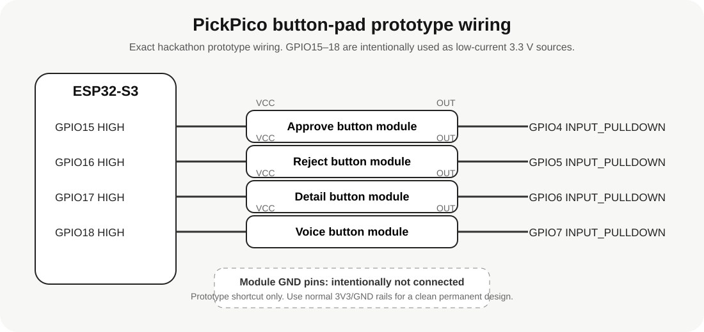

# PickPico four-button BLE pad

This firmware turns an ESP32-S3 into the four physical controls mounted on the PickPico phone stand.

## Default wiring

The current demo uses four 3-pin button modules. Each module's `OUT` connects to its input GPIO, while `VCC` is supplied by a dedicated GPIO held at 3.3 V. The module's `GND` pin remains disconnected. Internal pull-downs keep the inputs LOW while idle, and a press drives `OUT` HIGH.



### Wiring map

| Button | OUT GPIO | VCC GPIO | Android action |
| --- | ---: | ---: | --- |
| Approve | 4 | 15 | Complete the newest waiting human-help request with its positive/first action |
| Reject | 5 | 16 | Complete it with its negative/second action |
| Detail | 6 | 17 | Open the newest waiting human-help request on the phone |
| Voice | 7 | 18 | Hold to record from the phone microphone; release to send the WAV reply to the Agent |

Change the `PIN_*` and matching `PIN_POWER_*` constants in `pickpico_button_pad.ino` if the final CS533 shell uses different pins. Do not wire these inputs to GND unless the firmware is also changed to `INPUT_PULLUP` with active-LOW presses.

### Why the wiring looks unusual

This is the exact wiring used by the hackathon prototype, not a general-purpose recommendation.

The available 3-pin button modules expose `VCC`, `OUT`, and `GND`, but the prototype was assembled with a limited set of convenient pins inside the CS533 shell. To avoid routing a shared 3.3 V rail and ground rail through the cramped enclosure, four spare GPIOs (`15`–`18`) are configured as outputs and held `HIGH`. Each one acts as a low-current 3.3 V source for one button module. The module's `GND` pin is intentionally left disconnected, while the matching input (`GPIO4`–`GPIO7`) uses the ESP32-S3 internal `INPUT_PULLDOWN` resistor.

When a button is idle, the input is held LOW by the internal pull-down. Pressing the button connects the module's powered side to `OUT`, so the input goes HIGH and the firmware emits the corresponding BLE event.

In short:

```text
GPIO15 ── VCC [Approve module] OUT ── GPIO4   (GND unused)
GPIO16 ── VCC [Reject  module] OUT ── GPIO5   (GND unused)
GPIO17 ── VCC [Detail  module] OUT ── GPIO6   (GND unused)
GPIO18 ── VCC [Voice   module] OUT ── GPIO7   (GND unused)
```

This works for these simple, very-low-current button modules, but it is intentionally a prototype shortcut. For a cleaner permanent PCB or a different module, use the ESP32-S3 `3V3` and `GND` rails normally and update the input logic if needed. Do not use GPIO pins as power sources for arbitrary peripherals or anything with meaningful current draw.

### Rebuilding later

The ESP32 source is kept in this repository so the PickPico dock can be restored even if the physical board is normally flashed with another firmware.

```bash
cd firmware/pickpico-button-pad
pio run
pio run -t upload
```

The tested target is an ESP32-S3 DevKitC-style board. The firmware advertises as `PickPico Buttons`; the Android app discovers it by service UUID and reconnects automatically while the PickPico node service is running.

## BLE protocol

Device name: `PickPico Buttons`

Service UUID: `5f7c0001-8ec5-4d31-9ba1-1b99d0c6a001`

Notify characteristic UUID: `5f7c0002-8ec5-4d31-9ba1-1b99d0c6a001`

Each notification is three bytes: `[version, event, sequence]`.

Events: `1=approve`, `2=reject`, `3=detail`, `4=voice down`, `5=voice up`.

No BLE bonding is required. PickPico scans for the service UUID and reconnects automatically while its node service is running.
